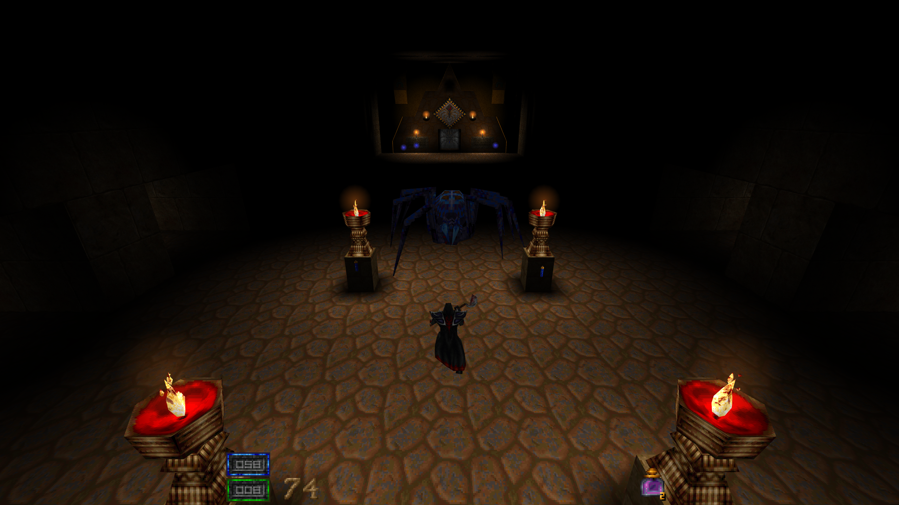

# Hexen II: Hexenwail


*New worlds await!* ([Wheel of Karma](https://www.moddb.com/mods/wheel-of-karma-a-tulku-odyssey), by Inky)

## [Latest Release](https://github.com/bobberb/hexenwail/releases) | [Report a Bug](https://github.com/bobberb/hexenwail/issues)

Just as [Ironwail](https://github.com/andrei-drexler/ironwail) took sezero's [QuakeSpasm](https://github.com/sezero/quakespasm) and modernized its renderer, Hexenwail does the same for Hexen II.

Raven Software released the Hexen II source code in 2000. [Hammer of Thyrion](http://uhexen2.sourceforge.net/) (2004–2018) by O. Sezer became the definitive cross-platform engine. [uHexen2](https://github.com/sezero/uhexen2) continued the work with graphical enhancements and mod support — notably Shanjaq and Inky's contributions. Hexenwail (2025) began when [Storm over Thyrion](https://www.moddb.com/mods/storm-over-thyrion) shipped without a buildable Linux client, and grew into a full GL 4.3 modernization.

Hexenwail does *not* include any original game assets; a valid copy of Hexen II is *required* and can be purchased from [GOG](https://www.gog.com/en/game/hexen_ii). You need `data1/pak0.pak` and `data1/pak1.pak`. For Portal of Praevus, add `portals/pak3.pak` and select it from the Mods menu (or launch with `-portals`).

See [USAGE.md](USAGE.md) for external textures, Steam Deck setup, and mod configuration.

## Platforms

| Platform | Renderer | Packaging | Status |
|----------|----------|-----------|--------|
| 64-bit Linux / SDL3 | OpenGL 4.3 | Nix, Flatpak, tarball | Supported |
| 64-bit Windows / SDL3 | OpenGL 4.3 | ZIP (cross-compiled from Nix) | Supported |

Planned:

| Platform | Renderer | Status |
|----------|----------|--------|
| Flathub listing | OpenGL 4.3 | Not started |
| AppImage | OpenGL 4.3 | Not started |

## Features

### Rendering
- Full GLSL 4.30 core pipeline — zero immediate mode, zero fixed-function
- Lightmap atlas, batched world draws, hardware-instanced alias models
- MSAA, FXAA, anisotropic filtering
- Render scale (25–100%), retro dithering mode
- Display presets: Faithful / Crunchy / Retro / Clean / Modern / Ultra
- Brightness/contrast via post-process shader
- Scrolling two-layer sky and skybox support
- Shader-based fog, underwater color tint, underwater warp, motion blur
- Fence textures, water tint options, glow effects with fog attenuation
- Per-entity alpha (ENTALPHA), translucent brush entities, model overbright, fullbright skins
- Correct index-0 transparency for all model skins (fixes black backgrounds on projectiles, weapons, items)
- External texture overrides for BSP textures, model skins, and HUD graphics (TGA/PNG/PCX)
- Physics/render decoupling with entity and lightstyle interpolation
- FOV slider, zoom, FPS limiter, HUD modes (Full/Mini/Off/Clean)

### Input
- WASD + mouselook defaults
- Scancode-based bindings (works on AZERTY, Dvorak, etc.)
- Mouse-driven menus with hover, click, and scroll wheel
- Key bindings menu with type-to-search (includes weapon impulses)
- Xbox/PlayStation/Nintendo gamepad with circular deadzone, power-curve easing, rumble, hot-plug
- Always-run, raw mouse input, configurable pitch clamp

### Mod support
- Protocol support (18/19/20/21), auto-detection and upgrade between 19–21
- Case-insensitive file lookups
- Runs [Wheel of Karma](https://www.moddb.com/mods/wheel-of-karma-a-tulku-odyssey) and [Storm over Thyrion](https://www.moddb.com/mods/storm-over-thyrion) out of the box
- [PimpModel](http://earthday.free.fr/Inkys-Hexen-II-Mapping-Corner/mapping-tricks-pimp.html) entity overrides
- Extended QuakeC builtins (`SOLID_GHOST`, entity alpha)
- 8192 max entities, 2048 sound channels
- Mods menu with runtime switching, per-mod config, portals data toggle
- TrueLightning (`cl_truelightning`)

### Audio
- OGG Vorbis, Opus, MP3, FLAC, WAV music (CD track fallback)
- Tracker music via libxmp (MOD/S3M/XM/IT) and UMX containers
- MIDI via FluidSynth (Linux) or native Windows MIDI, with soundfont auto-detection
- 2048 sound channels, 44.1 kHz default

### Platform
- SDL3 on Linux and Windows
- CMake build, Nix flake (reproducible builds + Windows cross-compilation), Flatpak
- GitHub Actions CI with smoke tests, shellcheck, and Nix caching
- One-command releases
- HiDPI, GL_KHR_debug diagnostics, console log to disk

## Building

See [BUILD.md](BUILD.md) for full instructions.

**Quick start (any Linux):**
```bash
cd engine && mkdir build && cd build
cmake .. && make -j$(nproc)
```

**Requirements:** OpenGL 4.3 (2012+), SDL3, libvorbis, libogg, libopus, opusfile, libxmp, ALSA (optional), FluidSynth (optional)

**Nix:**
```bash
nix build              # NixOS
nix build .#linux-fhs  # Portable Linux binary
nix build .#win64      # Windows 64-bit (cross-compiled)
nix build .#release    # All platforms
```

## Contributing

Contributions are welcome — bug reports, code cleanup, and documentation are all appreciated. Please file issues and pull requests on [GitHub](https://github.com/bobberb/hexenwail/issues).

## License

GPL-2.0-or-later. See [COPYING](COPYING).

Bundled third-party libraries:
- [dr_libs](https://github.com/mackron/dr_libs) (public domain / MIT-0) — MP3, FLAC, WAV decoders
- [SDL3](https://www.libsdl.org/) (Zlib) — platform abstraction
- [libogg/libvorbis](https://xiph.org/) (BSD-3) — OGG Vorbis audio
- [libopus/opusfile](https://opus-codec.org/) (BSD-3) — Opus audio
- [libxmp](https://github.com/libxmp/libxmp) (MIT) — tracker music (MOD, S3M, XM, IT)
- [FluidSynth](https://www.fluidsynth.org/) (LGPL-2.1) — MIDI synthesis

## Credits

Based on [uHexen2 / Hammer of Thyrion](http://uhexen2.sourceforge.net/) by O. Sezer and contributors, which is based on the Hexen II source release by [Raven Software](https://en.wikipedia.org/wiki/Raven_Software) and [id Software](https://en.wikipedia.org/wiki/Id_Software).

*The name? **Hexen** + Iron**wail** — a modernized Hexen II engine in the spirit of Ironwail for Quake.*

Incorporates code and techniques from the Quake engine modernization community:
- [Ironwail](https://github.com/andrei-drexler/ironwail) — GL 4.3 shader pipeline approach, software rendering emulation (palette dithering), render scale, gamepad input, scancode-based keyboard input, sound channel management
- [QuakeSpasm](https://sourceforge.net/projects/quakespasm/) — texture manager, fog system, console infrastructure
- [QuakeSpasm-Spiked](https://github.com/AAS/quakespasm-spiked) — protocol extensions, mod compatibility patterns
