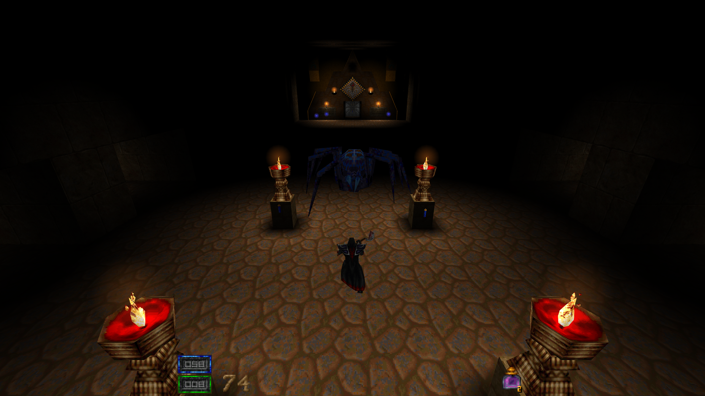
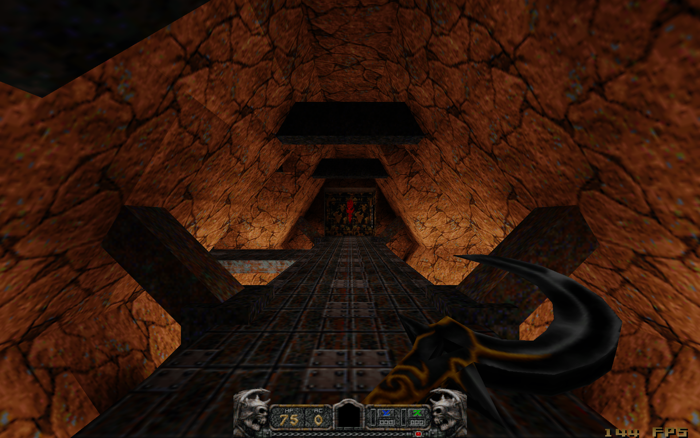
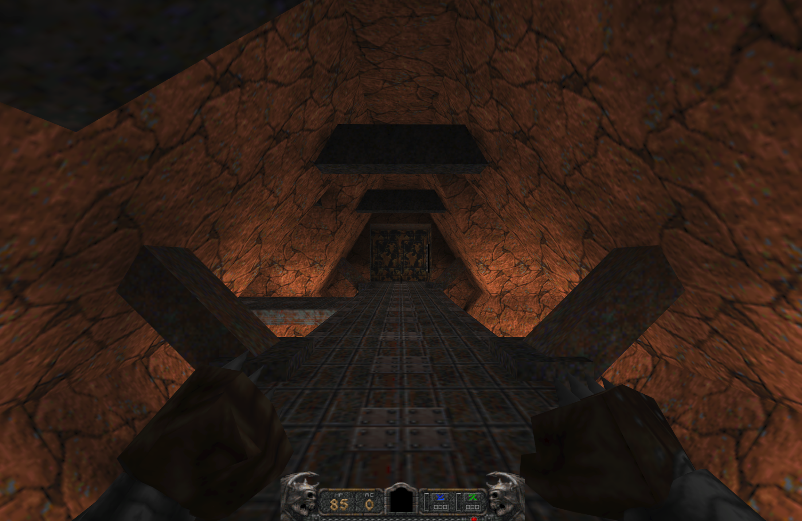
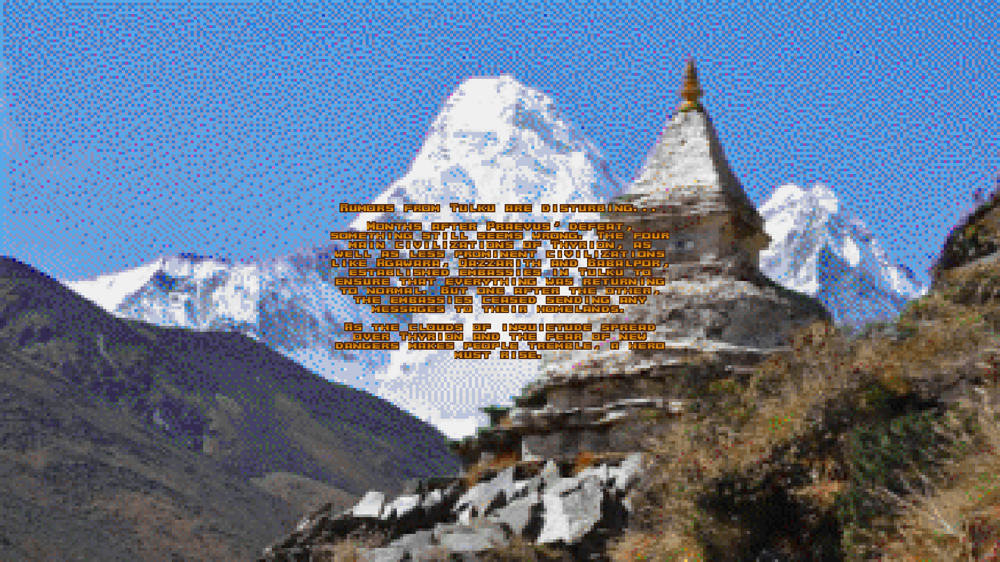
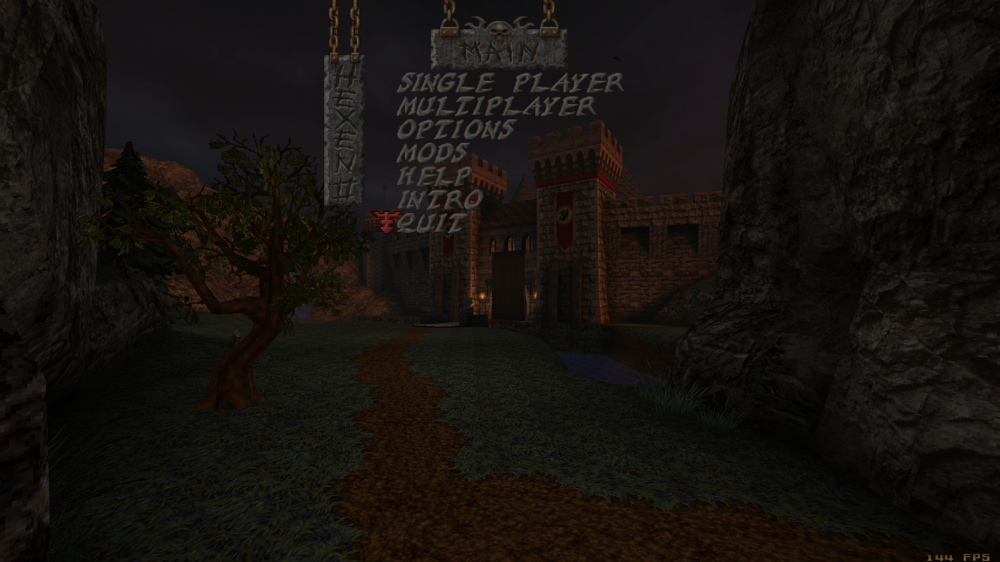
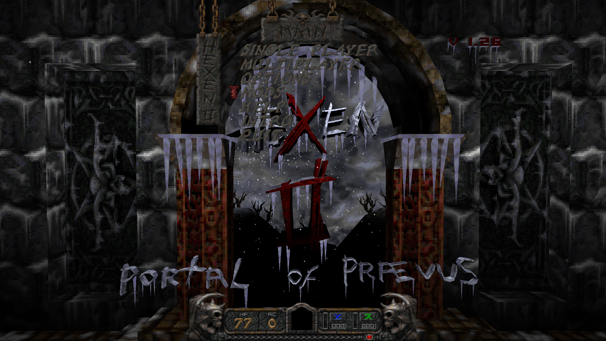
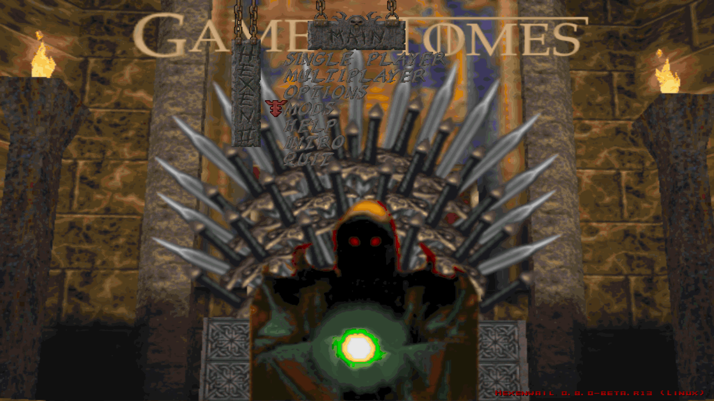

[](https://github.com/hexenwail/hexenwail/releases/latest)

# Hexen II: Hexenwail


*New worlds await!* ([Wheel of Karma](https://www.moddb.com/mods/wheel-of-karma-a-tulku-odyssey), by Inky)

## [Latest Release](https://github.com/hexenwail/hexenwail/releases) | [Report a Bug](https://github.com/hexenwail/hexenwail/issues)

Just as [Ironwail](https://github.com/andrei-drexler/ironwail) took sezero's [QuakeSpasm](https://github.com/sezero/quakespasm) and modernized its renderer, Hexenwail does the same for Hexen II.

Raven Software released the Hexen II source code in 2000. [Hammer of Thyrion](http://uhexen2.sourceforge.net/) (2004–2018) by O. Sezer became the definitive cross-platform engine. Modders continued the work with graphical enhancements and mod support — notably Shanjaq and Inky's contributions. Hexenwail (2025) began when [Storm over Thyrion](https://www.moddb.com/mods/storm-over-thyrion) shipped without a buildable Linux client, and grew into a full GL 4.3 modernization.

Hexenwail does *not* include any original game assets; a valid copy of Hexen II is *required* and can be purchased from [GOG](https://www.gog.com/en/game/hexen_ii). You need `data1/pak0.pak` and `data1/pak1.pak`. For Portal of Praevus, add `portals/pak3.pak`; it is auto-included when you launch with `-game modname` / `-mod modname` (use `-noportals` to opt out), and is toggleable from the Mods menu.

### Just want to try it?

The free three-level demo Raven released in November 1997 runs on Hexenwail, and a fetch helper ships beside the executable in every release. Unpack the release, then from that directory:

| | |
|---|---|
| Linux | `./get_demo.sh` |
| Windows | `get_demo.cmd` (double-click, or run from `cmd`) |
| Flatpak | launch it — you'll be offered the download when no game data is found |
| Nix | `nix run .#get-demo -- /path/to/hexenwail` |

In a source checkout the scripts live in `scripts/` instead, and `nix build .#demodata` is the declarative equivalent — it puts a hash-verified `data1` in the Nix store, playable with `nix run . -- -basedir ./result/share/hexenwail`.

Each downloads [`hexen2demo_nov1997-linux-i586.tgz`](https://sourceforge.net/projects/uhexen2/files/Hexen2Demo-Nov.1997/hexen2demo_nov1997-linux-i586.tgz/download) (13 MB) from the [uHexen2 project](https://sourceforge.net/projects/uhexen2/files/Hexen2Demo-Nov.1997/), verifies it against a known SHA-256, and installs only its `data1` directory. Nothing is overwritten if you already have game data. You can also fetch that tarball by hand and copy its `hexen2demo_nov1997/data1` next to the executable — the scripts do nothing more than that. We don't host or relicense that data — see [assets/demo/README.md](assets/demo/README.md) for its provenance and terms.

The demo covers the first three levels; copying `data1` from a GOG, Steam or disc installation over it unlocks the full game.

See [USAGE.md](USAGE.md) for external textures, Steam Deck setup, and mod configuration.

## Which version should I use?

**Lineage:** Hexen II by Raven Software, published by id Software *(1997)* → engine source open-sourced under the GPL *(2000)* → Anvil of Thyrion Linux port (Dan Olson & Clément Bourdarias) → Hammer of Thyrion / uHexen2 (O. Sezer, *2004*–2018; final release 1.5.9 on *2018-06-06*) → Shanjaq's additions → Hexenwail *(2026)*

There are three living branches of the Hexen II engine, depending on what you want to play:

- **Vanilla & upstream maintenance** — [Hammer of Thyrion / uHexen2](https://github.com/sezero/uhexen2), sezero's `main` branch. The reference cross-platform engine: the most faithful to the original release and the best base for general play and ongoing portability work.
- **Classic community mods (Shanjaq era)** — [Shanjaq's fork](https://github.com/shanjaq/uhexen2) through its final `uhexen2-r6303.zip` build. This is the engine many mods in the active [Hexen II Discord community](https://discord.gg/nC848XavDQ) were built and tested against, so it remains the safest choice for that catalog of content.
- **Steam Deck & modern systems** — Hexenwail (this project). A GL 4.3 / SDL3 modernization with gamepad support, render scaling, display presets, and Flatpak packaging, aimed at current hardware while staying mod-compatible.

## Platforms

| Platform | Renderer | Packaging | Status |
|----------|----------|-----------|--------|
| 64-bit Linux / SDL3 | OpenGL 4.3 | Nix, Flatpak, tarball | Supported |
| 64-bit Windows / SDL3 | OpenGL 4.3 | ZIP (cross-compiled from Nix) | Supported |
| Web / WASM (Emscripten) | WebGL2 | dev shell (`shell-wasm.nix`) | Builds and runs; hosting, data delivery, and save persistence in progress |

Planned:

| Platform | Renderer | Status |
|----------|----------|--------|
| Flathub listing | OpenGL 4.3 | Not started |
| AppImage | OpenGL 4.3 | Not started |
| Android / SDL3 | GLES3 | Not started — builds on the WASM/GLES render path |

## Features

### Rendering
- Full GLSL 4.30 core pipeline — zero immediate mode, zero fixed-function
- Reversed-Z depth buffer via `ARB_clip_control` (`gl_reversed_z`) for precision at distance
- Lightmap atlas, batched world draws, hardware-instanced alias models
- Unified-shader brush entity batched dispatch (`r_brush_inst`, default on) — same compiled program as world surfaces so within-shader `invariant gl_Position` covers coplanar joins
- MSAA, FXAA, anisotropic filtering
- Render scale (25–100%), retro dithering mode
- Display presets: Faithful / Crunchy / Retro / Clean / Modern / Ultra
- Brightness/contrast via post-process shader
- HDR tonemap with exposure slider
- Scrolling two-layer sky (configurable speed) and skybox support
- Shader-based fog, underwater color tint, underwater warp, underwater caustics (`r_caustics`), motion blur
- Fence textures, water tint options, glow effects with fog attenuation
- Per-entity alpha (ENTALPHA), translucent brush entities, world lightmap overbright (`gl_overbright`), model overbright (`gl_overbright_models`: 0 vanilla clamp, 1 unclamped, 2 doubled to match the world's range), fullbright skins
- Correct index-0 transparency for all model skins (fixes black backgrounds on projectiles, weapons, items)
- MD3 model format support (Quake 3 models with GPU-compressed vertex decoding)
- External texture overrides for BSP textures, model skins, particles and HUD graphics (DDS/KTX/PNG/TGA/PCX), with per-map override directories, `_glow`/`_luma` sidecars, and block-compressed (BC1–BC7) sources that cut HD-pack VRAM by 4–8x
- Physics/render decoupling with entity and lightstyle interpolation; pose-driven alias animation lerp (`r_lerpmodels`, `r_lerp_viewmodel`)
- FOV slider, FPS limiter, HUD modes (Full/Mini/Off/Clean)
- HUD / menu / crosshair / console scale sliders (auto by framebuffer height)
- Console alpha + brightness sliders

<table>
<tr>
<td width="50%"></td>
<td width="50%"></td>
</tr>
<tr>
<td align="center"><em>Overbright world lighting (<code>gl_overbright</code>, default on) under software colormap emulation (<code>r_softemu 3</code>) — lightmaps are built one bit dimmer and doubled back in the shader, so brightly lit surfaces keep their color instead of clipping to white.</em></td>
<td align="center"><em>The same corridor (captured from the web version in a Google Chrome tab) with emulation off (<code>r_softemu 0</code>) — filtered textures and unquantized lighting, the same overbright range without the 8-bit palette and point sampling.</em></td>
</tr>
</table>

### Input
- WASD + mouselook defaults
- Scancode-based bindings (works on AZERTY, Dvorak, etc.)
- Mouse-driven menus with hover, click, and scroll wheel
- Key bindings menu with type-to-search (includes weapon impulses)
- Live substring filter in Display/Rendering/Graphics/Game option submenus
- Xbox/PlayStation/Nintendo gamepad with circular deadzone, power-curve easing, rumble, hot-plug
- Always-run, raw mouse input, configurable pitch clamp, smooth-mouse filter (`m_filter`)

### Mod support
- Protocol support (18/19/20/21), auto-detection and upgrade between 19–21
- Case-insensitive file lookups
- Runs [Wheel of Karma](https://www.moddb.com/mods/wheel-of-karma-a-tulku-odyssey) and [Storm over Thyrion](https://www.moddb.com/mods/storm-over-thyrion) out of the box
- [PimpModel](http://earthday.free.fr/Inkys-Hexen-II-Mapping-Corner/mapping-tricks-pimp.html) entity overrides
- Extended QuakeC builtins (`SOLID_GHOST`, entity alpha)
- 8192 max entities, 2048 sound channels
- Mods menu (up to 128 entries, scrollable with PgUp/PgDn/Home/End/mousewheel), per-mod config, portals data toggle
- Per-liquid alpha (`r_wateralpha`, `r_lavaalpha`, `r_slimealpha`, `r_telealpha`) + `r_turbalpha` catch-all for custom-named mod liquids
- TrueLightning (`cl_truelightning`)
- Ships its own rebuilt `progs.dat`/`progs2.dat`/`portals/progs.dat` beside the executable and prefers it to your Hexen II install's copy — nothing is copied or overwritten on either platform, and a mod's own `progs.dat` (or anything you place in `~/.hexen2`) always wins over ours. **Options → Game → Gamecode from** picks the source by *place*: `Bundled`, `Loose` (your install's own gamedir) or `Pak` (the pak copy specifically, offered when a loose file is shadowing it). `-vanillaprogs` outranks all three and opts back out to Raven's 1997 gamecode. The console names both the file and whose code it turned out to be at every map load. See `gamecode/README.txt`.
- Mods can add their own rows to the Key Setup menu via `bindlist.lst`, merged alongside the engine's own key bindings

### Mod showcase

<table>
<tr>
<td width="25%"><a href="https://www.moddb.com/mods/wheel-of-karma-a-tulku-odyssey"></a></td>
<td width="25%"><a href="https://www.moddb.com/mods/storm-over-thyrion"></a></td>
<td width="25%"><a href="https://www.moddb.com/mods/hexen-ii-shadows-of-chaos"></a></td>
<td width="25%"><a href="https://www.moddb.com/mods/game-of-tomes"></a></td>
</tr>
</table>

### Audio
- OGG Vorbis, Opus, MP3, FLAC, WAV music (CD track fallback)
- Tracker music via libxmp (MOD/S3M/XM/IT) and UMX containers
- MIDI via FluidSynth (Linux) or native Windows MIDI, with soundfont auto-detection; libTiMidity plays the same soundfont as a fallback wherever FluidSynth isn't found
- Per-mod music subdirs (`<gamedir>/music/<author>/`)
- `bgm_remap NN <name>` — map a CD track number to a named music file
- Underwater audio low-pass (`snd_waterfx`)
- 2048 sound channels, 44.1 kHz default

### Custom music for mappers
Two ways to attach music to a custom map:

1. **Named music (recommended)** — set worldspawn keys in your BSP:
   ```
   "MIDI" "arena"
   "CD"   "10"          // numeric fallback for engines without MIDI-key support
   ```
   Ship `<gamedir>/music/arena.ogg` (or `.opus`/`.mp3`/`.flac`/`.wav`/`.mid`/etc.).
   Hexenwail also looks under `<gamedir>/music/<subdir>/arena.ogg` so multiple
   authors can keep their tracks in separate folders without colliding.

2. **Numeric track + remap** — keep the legacy `track%02d.ogg` layout but use
   `bgm_remap` from the console (or autoexec.cfg) to point a numeric track at
   any named file:
   ```
   bgm_remap 18 myambient
   bgm_remap list
   bgm_remap 18 -            // clear
   ```

### Skybox and fog for mappers
Engine-only worldspawn keys take the underscore prefix, so they never collide
with the HexenC field namespace and your progs doesn't have to declare them:

```
"_sky"    "grimmnight_"      // loads gfx/env/grimmnight_{rt,bk,lf,ft,up,dn}
"_skyfog" "0.5"
"_fog"    "0.037 0.08 0.07 0.18"   // density r g b
```

The unprefixed `sky`, `skyname` (Half-Life), `qlsky` (Quake Lives), `skyfog`
and `fog` spellings are still accepted for maps that already ship them, and
neither spelling produces an `'sky' is not a field` warning any more. `sky
<name>` also works from the console.

### Platform
- SDL3 on Linux and Windows
- CMake build, Nix flake (reproducible builds + Windows cross-compilation), Flatpak
- GitHub Actions CI with smoke tests, shellcheck, and Nix caching
- One-command releases
- HiDPI, GL_KHR_debug diagnostics, console log to disk

## Building

See [docs/COMPILE](docs/COMPILE) for full instructions.

### Web / iPadOS PWA

A GitHub-Pages-deployable WebAssembly/PWA shell now lives under [`web/`](web/) with setup notes in [docs/PWA.md](docs/PWA.md). It targets installable, offline-capable play after the user imports their own legal Hexen II assets.

**Quick start (any Linux):**
```bash
cd engine && mkdir build && cd build
cmake .. && make -j$(nproc)
```

**Requirements:** OpenGL 4.3 (2012+), SDL3, libvorbis, libogg, libopus, opusfile, libxmp, ALSA (optional), FluidSynth (optional)

**Nix:**
```bash
nix build              # NixOS
nix build .#linux-fhs  # Portable Linux binary
nix build .#win64      # Windows 64-bit (cross-compiled)
nix build .#release    # All platforms
```

## Contributing

Contributions are welcome — bug reports, code cleanup, and documentation are all appreciated. See [CONTRIBUTING.md](CONTRIBUTING.md) for how to build, what CI checks, and the two rules that matter most (Ironwail parity and mod compatibility).

- **Found a bug?** [File it here](https://github.com/hexenwail/hexenwail/issues/new/choose) — the forms ask for your `qconsole.log`, GPU and driver, which is what makes a report fixable.
- **Found a security issue?** Please report it privately instead — see [SECURITY.md](SECURITY.md).

## License

GPL-2.0-or-later. See [LICENSE](LICENSE).

Bundled third-party libraries:
- [dr_libs](https://github.com/mackron/dr_libs) (public domain / MIT-0) — MP3, FLAC, WAV decoders
- [SDL3](https://www.libsdl.org/) (Zlib) — platform abstraction
- [libogg/libvorbis](https://xiph.org/) (BSD-3) — OGG Vorbis audio
- [libopus/opusfile](https://opus-codec.org/) (BSD-3) — Opus audio
- [libxmp](https://github.com/libxmp/libxmp) (MIT) — tracker music (MOD, S3M, XM, IT)
- [FluidSynth](https://www.fluidsynth.org/) (LGPL-2.1) — MIDI synthesis

## Credits

Based on [uHexen2 / Hammer of Thyrion](http://uhexen2.sourceforge.net/) by O. Sezer and contributors, which is based on the Hexen II source release by [Raven Software](https://en.wikipedia.org/wiki/Raven_Software) and [id Software](https://en.wikipedia.org/wiki/Id_Software).

*The name? **Hexen** + Iron**wail** — a modernized Hexen II engine in the spirit of Ironwail for Quake.*

Incorporates code and techniques from the Quake engine modernization community:
- [Ironwail](https://github.com/andrei-drexler/ironwail) — GL 4.3 shader pipeline approach, software rendering emulation (palette dithering), render scale, gamepad input, scancode-based keyboard input, sound channel management
- [QuakeSpasm](https://sourceforge.net/projects/quakespasm/) — texture manager, fog system, console infrastructure
- [QuakeSpasm-Spiked](https://github.com/Shpoike/Quakespasm) — protocol extensions, mod compatibility patterns

Gamecode fixes:
- [jsHexen2-progs](https://github.com/KoMiKoZa/jsHexen2-progs) by KoMiKoZa — a curated bugfix fork of the Portal of Praevus HexenC source. Its diagnosis of `RandomMonsterGoodies` rolling monster loot onto the corpse instead of onto the dropped item — the root cause behind "Bad backpack!", present since Raven shipped it in 1997 — is the basis of our fix in `gamecode/hc/portals/items.hc`. Where its choices differ from ours, ours are the ones recorded in `gamecode/README`.

---

Hexenwail is a fan project and is not affiliated with Raven Software or id Software. Hexen and Quake are trademarks of their respective owners.
